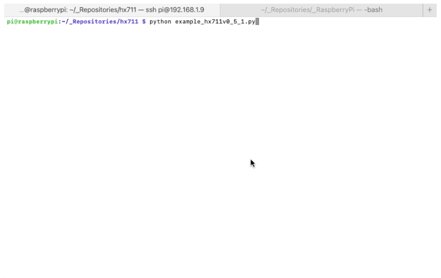
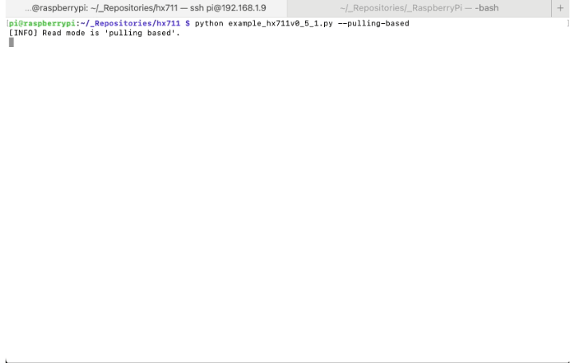

# HX711 for Raspbery Pi

This code is credited to [underdoeg](https://github.com/underdoeg/)'s gist [ HX711.py](https://gist.github.com/underdoeg/98a38b54f889fce2b237).

I've only made a few modifications on the way the captured bits are processed and to support Two's Complement, which it didn't.

I'm currently trying to improve this version. It's actually working, I'd use `hx711v_0_5_1.py`.

## Warning: Possible random values

>  **Possible random values!**
>  Polling the bits from the HX711 is a time sensitive process as explained in the HX711 the datasheet. Raspberry runs on Linux which is not a good tool for time sensitive operations using the GPIO pins because tasks are prioritized by the Operative System which might delay a GPIO operation, causing the library to fail to poll the bits following the specified timing in the datasheet. It could also happen that the commands that poll the pins up and down run too fast for the HX711.
>
>  If there is a right way to precisely poll the bits with a Raspberry Pi (i.e. Linux OS) following the datasheet's timing specifications, which is in microseconds, which is a millionth of a second, then this code is probably not doing it in that right way and might return random values if other processes are running simultanously, delaying the GPIO operations, or if the processor is not busy with anything else at all, allowing the GPIO operations to happen too fast.
>
>  I know very little about OS architecture, but it seems to me that this two scenarios could happen. I'm not event a developer as you can see by how ugly the code and my commits are, so I'd think twice before trusting this code, haha.
>
>  I'm think that a better idea is to wire the HX711 to an MCU and the MCU to the Raspberry Pi. The MCU could poll a pin to trigger an event on the Raspberry Pi so that the Pi could retrieve the data from the MCU using 1-Wire or I2C, probably. Maybe a feature for the future.
>
>  So, at the risk of repeating myself, I do recommend using an Arduino or any MCU instead of a Raspberry Pi to poll bits from the HX711. and if you really need an Raspberry involved, then have the Arduino send the information to the Raspberry Pi vía I2C or 1-Wire. Hope this library helps, though.

## Table of contents

1. [Files description](#files-description)
2. [Instructions](#instructions)
3. [Usage with two channels](#usage-with-two-channels)
4. [Changelog](#changelog)

## Files description

File descriptions:
- `hx711.py`: v0.1 code. Readings are not near as frequent as they could be. Currently, it's barely doing 1 reading per second when the HX711 allows for 10SPS (Samples Per Second), which translates to 10 readings per second.
- `example.py`: Example of how to use `hx711.py`. The exaplanation is not good at all.
- `hx711_emulator.py`: This is a class that emulates the behaviour of my original HX711 class. It's actually more a simulator than an emulator.
- `example_emulator.py`: Show an example but using the emulator class.
- `hx711v0_5_1.py`: This a new version I've just created, _**tested and working pretty well**_, with the objective of allowing 10 readings per second. They will be provided by some sort of event I still need to figure out how to create and how to throttle somehow.
- `example_hx711v0_5_1.py`: 

## Instructions

### New Version

No "setup.py" required if you're on Raspbian OS. I'm actually using the Lite Version without GUI to avoid processes messing up with the bit polling process.

#### Interrupt based

```bash
clone git@github.com:tatobari/hx711py.git
python example_hx711v0_5_1.py
```



#### Polling based

```bash
clone git@github.com:tatobari/hx711py.git
python example_hx711v0_5_1.py --polling-based
```



### Legacy Version
To install the old version (hx711.py):

```bash
clone git@github.com:tatobari/hx711py.git
python setup.py install
python example.py
```

## About using the two channels of one breakout board

This is a completely unnecessary feature that I, for some reason, decided to include in the original code. Anyway, in theory, it allows using two loadcells at the same time but they would have different two gains. So, though they would provide different raw values, both provide weights, just with different accuracy.

I haven't tested the use of two loadcells on the same breakout board at the same time. It might not work.

Channel A has selectable gain of 128 or 64.  Using set_gain(128) or set_gain(64) selects channel A with the specified gain.

Using set_gain(32) selects channel B at the fixed gain of 32. The tare_B(), get_value_B() and get_weight_B() functions do this for you.

This info was obtained from an HX711 datasheet located at:
https://cdn.sparkfun.com/datasheets/Sensors/ForceFlex/hx711_english.pdf

## Changelog

### 03/03/2023

- Changed the filename of the new version to make a bit more sense (Sorry for not making a new branch for the new verison.).
- Added example file for v0.5.1.
- Added GIF examples of new library to README.md.
- Added example commands to README.md.
- **Tested v0.5.1 and working.**

### 28/02/2023

I'm only using my lunch time to commit changes in order to close all the HX711 environment on my mac because I need more processing power.

This version adds new methods to allow the use of interrupts as an alternative to polling.

### 25/02/2023

Funily enough and by pure accident, exactly two years after updating the README.md file with false promises, I'm back making a few changes.

My motivation to update this code is to improve the reading frequency.

### 25/02/2021

For the past years I haven't been able to maintain this library because I had too much workload. Now I'm back and I've been working on a few fixes and modifications to simplify this library, and I might be commiting the branch by mid-March. I will also publish it to PIP.
